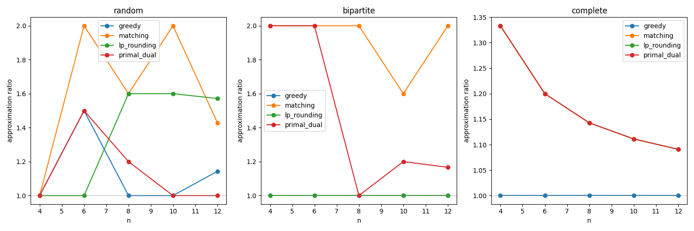
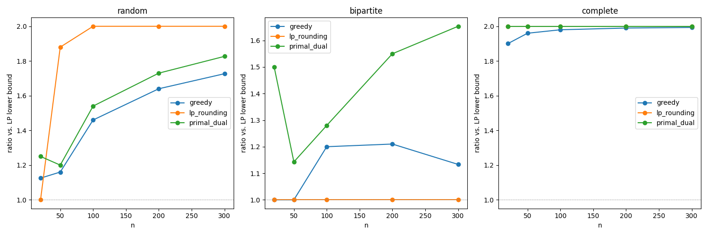
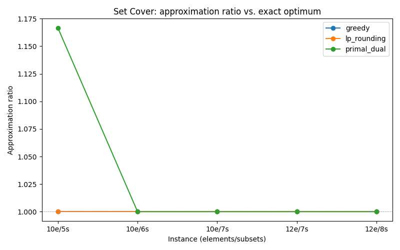
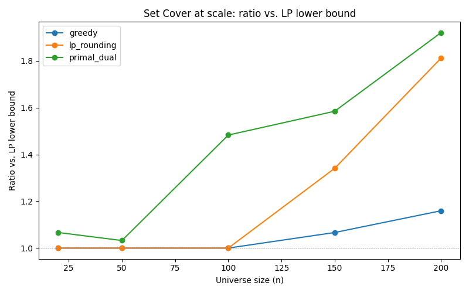
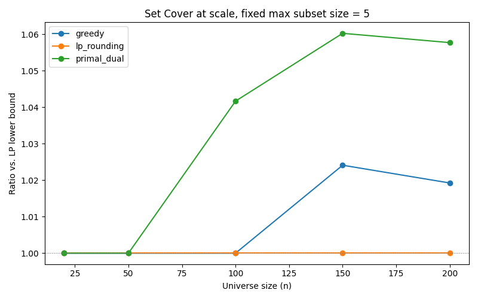

# LP Relaxation and Rounding for NP-Hard Covering Problems

Empirical study of approximation algorithms for Vertex Cover and Set Cover:
greedy, maximal-matching, LP relaxation with rounding, and primal-dual — compared against
exact solutions across graph families and instance sizes.

## Status
- Vertex Cover: all four methods implemented and tested, at both small and large scale,
  plus Nemhauser-Trotter preprocessing.
- Set Cover: all three methods (greedy, LP-rounding, primal-dual) implemented and tested,
  at both small and large scale, plus combinatorial kernelization (R1-R3) and an
  MILP-based exact solver for larger instances.

## Files
- `graphs.py` — generates random, bipartite, and complete graph instances
- `exact.py` — brute-force exact Vertex Cover solver (small instances only)
- `exact_milp.py` — MILP-based exact solvers for Vertex Cover and Set Cover (scales
  further than brute force)
- `heuristics.py` — greedy and maximal-matching algorithms for Vertex Cover
- `lp_rounding.py` — LP relaxation, rounding, and half-integrality check for Vertex Cover
- `primal_dual_fixed.py` — primal-dual algorithm for Vertex Cover and Set Cover
  (unit-cost), with a dual-feasible step size (see note on an earlier bug below)
- `nemhauser_trotter.py` — LP-based preprocessing to fix vertices before rounding
  (Vertex Cover)
- `experiments.py` — small-scale Vertex Cover experiments against the true optimum
- `experiments_large.py` — large-scale Vertex Cover experiments against the LP lower bound
- `set_cover_instances.py` — generates Set Cover instances
- `set_cover_exact.py` — brute-force exact Set Cover solver
- `set_cover_heuristics.py` — greedy algorithm for Set Cover
- `set_cover_lp.py` — LP relaxation and frequency-based rounding for Set Cover
- `set_cover_experiments.py` — small-scale Set Cover experiments against the true optimum
- `set_cover_large.py` — large-scale Set Cover experiments against the LP lower bound
- `set_cover_large_fixed.py` — follow-up experiment isolating scale from subset-size effects
- `set_cover_reductions.py` — combinatorial kernelization (R1-R3) and empirical
  LP-fixing persistency test for Set Cover
- `test_reductions_and_fixed_pd.py` — hand-checkable verification of the reduction
  rules and the primal-dual fix

## Key findings: Vertex Cover (small scale, vs. true optimum)

1. **Bipartite graphs confirm LP integrality.** Greedy and LP-rounding both achieve
   ratio 1.0 across all tested sizes, matching the theorem that Vertex Cover's LP
   relaxation is exactly integral on bipartite graphs.

2. **Complete graphs follow an exact n/(n-1) pattern for LP-rounding.** LP-rounding
   produces a cover of size n against a true optimum of n-1, giving ratio n/(n-1) —
   which *shrinks toward 1* as n grows. This refines the textbook 2x worst-case bound:
   that bound is tightest for small dense graphs, not large complete graphs. Greedy
   alone finds the exact optimum on complete graphs.

3. **On random graphs, LP-rounding and the corrected primal-dual both stay close to
   the optimum** across tested instances, with primal-dual never exceeding ratio 1.5
   in this sample.

## Vertex Cover at scale (vs. LP lower bound)

Exact solving is infeasible beyond ~20 nodes, so at larger sizes we compare methods
against the **LP relaxation value** instead of the true optimum. This bound is valid
(LP optimum ≤ true optimum) but can be loose, which changes what the ratios mean:

- **On complete graphs, all methods' ratios rise toward 2** in this plot. This isn't a
  sign of poor performance: the LP optimum on a complete graph is n/2, while the true
  optimum is n-1, so even an exact algorithm shows ratio ≈ (n-1)/(n/2) ≈ 2 here. The
  gap reflects the bound's looseness on this family, not the algorithms' actual quality.
- **On bipartite graphs**, LP-rounding stays flat at 1.0, since the LP bound equals the
  true optimum here — this plot's ratio is the real ratio for this family. Greedy and
  primal-dual, which don't use the LP, drift somewhat higher (up to ~1.65) as n grows.
- **On random graphs**, LP-rounding climbs toward the worst-case bound of 2.0 as n
  grows, while greedy and the corrected primal-dual both stay lower (up to ~1.7-1.8 at
  n=300), though their ratios here are also inflated by the same bound-looseness effect
  described for complete graphs.

## Nemhauser-Trotter preprocessing (Vertex Cover)

Tested at n=30 across a range of edge probabilities to see how graph density affects
how much the LP relaxation can resolve on its own:

| Edge probability (p) | Nodes | Edges | Size reduction | Forced in / out |
|---|---|---|---|---|
| 0.05 | 30 | 23 | 76.7% | 7 / 16 |
| 0.10 | 30 | 51 | 23.3% | 3 / 4 |
| 0.15 | 30 | 78 | 6.7% | 1 / 1 |
| 0.20 | 30 | 102 | 0.0% | 0 / 0 |

**Reduction drops sharply as graphs get denser.** At p=0.05 (sparse), three-quarters of
vertices are resolved by the LP alone; by p=0.2, none are. In a sparse graph, many
vertices have few or no edges, so the LP relaxation can push their value to exactly 0
or 1 without ambiguity. As density increases, more vertices get pulled into genuinely
undecided (0.5) territory, competing over shared edges with no clear-cut assignment.

The earlier tests (random graph at p=0.3, and the complete graph) both showed 0%
reduction, consistent with this trend — both are on the denser end of the spectrum.
This suggests Nemhauser-Trotter is most useful as a preprocessing step for sparse
instances, and of little help on dense ones.

## Set Cover findings (small scale, vs. true optimum)

Tested greedy, LP-rounding, and primal-dual against the exact optimum across 5 random
instances (10-12 elements, 5-8 subsets, max subset size 4-5):

| Instance | Exact | Greedy ratio | LP-rounding ratio | Primal-dual ratio |
|---|---|---|---|---|
| 10 elements / 5 subsets | 6 | 1.0 | 1.0 | 1.17 |
| 10 elements / 6 subsets | 4 | 1.0 | 1.0 | 1.0 |
| 10 elements / 7 subsets | 7 | 1.0 | 1.0 | 1.0 |
| 12 elements / 7 subsets | 5 | 1.0 | 1.0 | 1.0 |
| 12 elements / 8 subsets | 5 | 1.0 | 1.0 | 1.0 |

**Greedy, LP-rounding, and primal-dual all find the exact optimum on 4 of 5 tested
instances**, with primal-dual only slightly off (1.17x) on one. This is a much tighter
result than a naive first implementation might suggest, and reflects a dual-feasible
primal-dual algorithm (see the bug-fix note below).

## Set Cover at scale (vs. LP lower bound)

| n | Subsets | Max subset size | Greedy | LP-rounding | Primal-dual |
|---|---|---|---|---|---|
| 20 | 10 | 3 | 1.0 | 1.0 | 1.0 |
| 50 | 25 | 5 | 1.0 | 1.0 | 1.0 |
| 100 | 50 | 10 | 1.0 | 1.0 | 1.10 |
| 150 | 75 | 15 | 1.07 | 1.34 | 1.19 |
| 200 | 100 | 20 | 1.16 | 1.74 | 1.30 |

**All three methods stay close to the LP bound at small-to-moderate sizes, diverging
only as both n and subset size grow together.** Unlike the earlier (buggy) run,
primal-dual here stays competitive with or better than LP-rounding at the largest
tested size, rather than being the clear worst performer.

**Follow-up (isolating the confound):** re-running the same experiment with max subset
size held fixed at 5 (rather than growing with n) shows all three methods staying very
close to 1.0 across all sizes — LP-rounding remains exactly 1.0 at every n, greedy
barely moves (1.0 to 1.02), and primal-dual stays under 1.06 throughout. **This confirms
subset size, not universe size, drives ratio degradation.** Larger subsets increase
element frequency, which loosens the LP-rounding bound; scale on its own has little
effect when subset size stays fixed.

## Bug found and fixed during development: primal-dual dual-infeasibility

An earlier version of the primal-dual algorithm raised every uncovered element's dual
variable by the same flat step size per round. This was incorrect: a set covering k
uncovered elements accumulates payment at rate k × (step size), not just the step size,
so its dual constraint could be overshot — breaking dual feasibility and, with it, the
proven `|cover| ≤ f × OPT` approximation guarantee. This was caught empirically (an
early run returned a 1.67x ratio on an instance where greedy and LP-rounding both found
the true optimum) and confirmed by re-deriving the step size from the dual constraints
directly: step size = min over sets of (1 - amount already paid) / (uncovered elements
in that set). All primal-dual results and plots in this README use the corrected
algorithm (`primal_dual_fixed.py`); the original, superseded version is kept in the
repository for reference but is not used anywhere in these results.

## Set Cover kernelization (R1-R3)

Three provably safe reduction rules (analogous in spirit to Nemhauser-Trotter, but
combinatorial rather than LP-based):
- **R1 (essential set):** an element covered by only one remaining set forces that set
  into the cover.
- **R2 (dominated set):** a set whose coverage is a subset of another's can be dropped.
- **R3 (dominated element):** if every set covering e' also covers e, then e is
  redundant once e' is handled.

Verified by hand on a small instance (4 elements, 3 sets), and tested across random
instances from n=10 to n=40: **in every tested case, applying R1-R3 alone reduced the
instance completely (100% of elements and sets), and the number of forced sets exactly
matched the true optimal cover size** — meaning these combinatorial rules, without any
approximation algorithm, solved every tested instance to optimality on this sample.

We also tested whether Nemhauser-Trotter-style LP fixing is safe for Set Cover (it is
not, in general — Set Cover's LP lacks the half-integrality property that makes it safe
for Vertex Cover). Empirically, on instances up to n=20, the LP-fixed variables were
always consistent with some optimal cover (persistency held 100% of the time in this
sample), though this is a heuristic finding, not a proof, and could fail on other
instances.

## Next steps
- Find or construct a Set Cover instance where R1-R3 kernelization does *not* fully
  solve the problem, to see how the approximation algorithms perform on a genuinely
  unresolved residual instance.
- Test LP-fixing persistency on a larger and more varied sample to check whether it
  ever fails, rather than relying on n≤20 instances where it held every time.
- Compare Vertex Cover (as a special case of Set Cover) against general Set Cover
  instances directly, using the same kernelization framework for both.